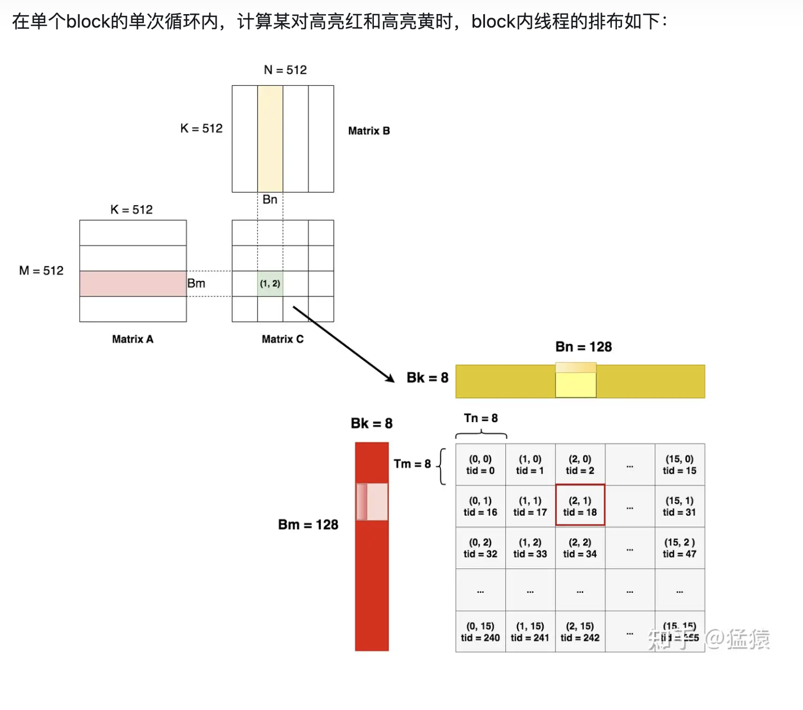

# ncu benchmark 结果
|  kernel   | grid_size | block_size |  耗时  | 计算吞吐 | 内存吞吐 | 内存带宽 |
|  ----  | ----  |  ----  | ----  | ----  | ---- | ---- |
| naive  | (16,16,1) | (32,32,1)  | 255.55 | 62.95%  | 63.05% | 8.26Gb/s |
| V1  | (4,4,1) | (16,16,1)  | 222.85 | 18.16%  | 13.49% | 9.41Gb/s |

# naive Kernel
最暴力的写法，开 M*N 个线程，一个线程计算 C 的一个元素，一个线程计算 A 的一行和 B 的一列的累加和

# sgemm_V1 Kernel
分块 shared memory + split-K 寄存器 (存在 bank-conflict)，参考：[从啥也不会到 CUDA GEMM 优化](https://zhuanlan.zhihu.com/p/703256080)<br>

想理解一个 kernel，首先得理解它的 block 分块计算逻辑（知道它是怎么切分数据的以及哪些 block 计算数据的哪些部分，哪些 thread 计算数据的哪些部分）。<br>

该 kernel 分了 16 个 block（div(M, BM)，div(N, BN)）分别计算 C 矩阵分出来的 16 个子矩阵，每个 block 内有 256 个线程（一个线程计算 TM*TN 个元素，div(BN, TN), div(BM,TM)），更多请结合下图理解。



然后就是这个 Kernel 中的四个变量的含义和作用：
```
load_a_smem_m: 该thread负责加载的第一个数在s_a中的row
load_a_smem_k: 该thread负责加载的第一个数在s_a中的col
load_b_smem_k: 该thread负责加载的第一个数在s_b中的row
load_b_smem_n: 该thread负责加载的第一个数在s_b中的col
```
为什么需要定义这四个奇怪的变量呢？首先我们 kernel 的第一步就是将输入数据的分块存入 shared memory 中，那么就需要根据当前块中的 threadId 得到全局的 threadId 从而拿到输入数据指针中对应的数据。<br>

而这里全局 threadId 是这么算的:
```
int load_a_gmem_m = by * BM + load_a_smem_m;  // global row of a
int load_b_gmem_n = bx * BN + load_b_smem_n;  // global col of b
```
其中 by = blockIdx.y, bx = blockIdx.x，如此一来就知道为什么要这么索引了，也即知道了 load_a_smem_m 的含义了。