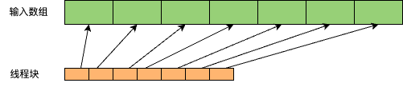
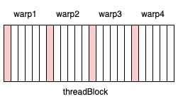

# __shfl_down_sync 的作用和用法：

下面代码在开启一个 block，这个 block 线程数目正好为 32 一个 warp 里线程数目，输入数组的元素的值为 arr[i] = i + 1：
```
_global__ void warpReduce(float* input) {
    int tid = threadIdx.x;
    float value = input[tid];
    int offset = 16;
    float other_thread_value = __shfl_down_sync(0xFFFFFFFF, value, offset);
    printf("当前 threadId: %d, 当前 value: %f, offset 为 16 的 thread 的 value: %f\n", tid, value, other_thread_value);

}
```
其输出结果为：
```
当前 threadId: 0, 当前 value: 1.000000, offset 为 16 的 thread 的 value: 17.000000
当前 threadId: 1, 当前 value: 2.000000, offset 为 16 的 thread 的 value: 18.000000
当前 threadId: 2, 当前 value: 3.000000, offset 为 16 的 thread 的 value: 19.000000
.
.
.
当前 threadId: 26, 当前 value: 27.000000, offset 为 16 的 thread 的 value: 27.000000
当前 threadId: 27, 当前 value: 28.000000, offset 为 16 的 thread 的 value: 28.000000
当前 threadId: 28, 当前 value: 29.000000, offset 为 16 的 thread 的 value: 29.000000
当前 threadId: 29, 当前 value: 30.000000, offset 为 16 的 thread 的 value: 30.000000
当前 threadId: 30, 当前 value: 31.000000, offset 为 16 的 thread 的 value: 31.000000
当前 threadId: 31, 当前 value: 32.000000, offset 为 16 的 thread 的 value: 32.000000
```

在开启一个 block，block 内线程数目为 64 两个 warp 里线程数目时，输出结果为：
```
当前 threadId: 32, 当前 value: 33.000000, offset 为 16 的 thread 的 value: 49.000000
当前 threadId: 33, 当前 value: 34.000000, offset 为 16 的 thread 的 value: 50.000000
当前 threadId: 34, 当前 value: 35.000000, offset 为 16 的 thread 的 value: 51.000000
...
当前 threadId: 61, 当前 value: 62.000000, offset 为 16 的 thread 的 value: 62.000000
当前 threadId: 62, 当前 value: 63.000000, offset 为 16 的 thread 的 value: 63.000000
当前 threadId: 63, 当前 value: 64.000000, offset 为 16 的 thread 的 value: 64.000000
当前 threadId: 0, 当前 value: 1.000000, offset 为 16 的 thread 的 value: 17.000000
当前 threadId: 1, 当前 value: 2.000000, offset 为 16 的 thread 的 value: 18.000000
当前 threadId: 2, 当前 value: 3.000000, offset 为 16 的 thread 的 value: 19.000000
....
当前 threadId: 29, 当前 value: 30.000000, offset 为 16 的 thread 的 value: 30.000000
当前 threadId: 30, 当前 value: 31.000000, offset 为 16 的 thread 的 value: 31.000000
当前 threadId: 31, 当前 value: 32.000000, offset 为 16 的 thread 的 value: 32.000000
```

上面两个 case 都是凑齐了 warp 数目的线程，下面设置一个 block，block 内线程数目为 35 时输出结果为：
```
当前 threadId: 32, 当前 value: 33.000000, offset 为 16 的 thread 的 value: 0.000000
当前 threadId: 33, 当前 value: 34.000000, offset 为 16 的 thread 的 value: 0.000000
当前 threadId: 34, 当前 value: 35.000000, offset 为 16 的 thread 的 value: 0.000000
当前 threadId: 0, 当前 value: 1.000000, offset 为 16 的 thread 的 value: 17.000000
当前 threadId: 1, 当前 value: 2.000000, offset 为 16 的 thread 的 value: 18.000000
当前 threadId: 2, 当前 value: 3.000000, offset 为 16 的 thread 的 value: 19.000000
...
当前 threadId: 29, 当前 value: 30.000000, offset 为 16 的 thread 的 value: 30.000000
当前 threadId: 30, 当前 value: 31.000000, offset 为 16 的 thread 的 value: 31.000000
当前 threadId: 31, 当前 value: 32.000000, offset 为 16 的 thread 的 value: 32.000000
```
可以发现没有凑齐 warp 数目的话，没有凑齐的 warp 里的线程拿到的 value 为 0（因为根本没有 offset 那个对应的线程）。

读完上面应该就理解了 __shfl_down_sync 的作用和用法。

下面我们来看下这个具体的 blockReduceKernel：

首先是 benchmark 结果：
在 A30 机器上，带宽利用率： 88.15%，时延 169.66 us

下面解析下代码：

首先解析下线程块和线程切分：



一个线程块负责一部分数目数组的归约和。而一个线程计算一个输入数组块的 NUM_PER_THREAD 个元素，而这 NUM_PER_THREAD 个元素在输入元素中的间隔为 blockSize（NUM_PER_THREAD等于一个输入数组块元素除线程块数目）。

然后在下面的代码中，一个线程块中的每个线程将它负责的 NUM_PER_THREAD 个元素累加和，这样一个输入数组块中的所有元素的累加和都被 offload 到一个线程块中。一个数组块元素的归约和就转换成一线程块的归约和。
```
    #pragma unroll
    for(int iter=0; iter<NUM_PER_THREAD; iter++){
        sum += g_idata[i+iter*blockSize];
    }
```

而下面这行代码做了一个 block 内的所有 warp 内的归约和，仔细看下 warpReduceSum 函数就知道。
```
    sum = warpReduceSum<blockSize>(sum);
```
然后一个 block 内的每个 warp 里的第一个线程存放着这个 warp 的归约和，如下图所示，假设一个 block 里有四个 warp，一个 warp 里的线程由于绘制限制这里画成 5 个，第一个元素（粉色）存放着 warp 的归约和




然后下面代码将这些粉色元素存放到 shared memory 中


```
    if(laneId == 0 )warpLevelSums[warpId] = sum;
```

由于上图所示的是这些部分归约和分布在间隔 warp 的线程里，不方便我们再次使用 warpReduceSum 进行线程内归约和，所以我们将这些部分归约和元素都放到第一个 warp 中，方便在这个 warp 中使用 warpReduceSum 以得到最终的 block 内所有元素归约和结果。

也就是下面代码块里的将 shared memory 里的元素放到第一个 warp 中

```
sum = (threadIdx.x < blockDim.x / WARP_SIZE) ? warpLevelSums[laneId] : 0;
```

最后在第一个 warp 内进行归约和，结果为这一个输入数组块元素的 blockReduceSum 存放在第一个 thread 上并存放在输出数据指针上。

```
    // Final reduce using first warp
    if (warpId == 0) sum = warpReduceSum<blockSize/WARP_SIZE>(sum); 
    // write result for this block to global mem
    if (tid == 0) g_odata[blockIdx.x] = sum;
```
输出数组长度为 thread block 数目，每个元素存放着对应 block 的归约和！