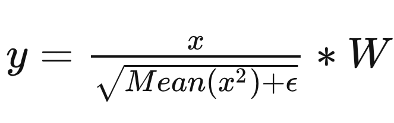

# 计算公式
my_rms_norm 算子接受三个输入：

- x : [num_tokens, hidden_size]
- W : [hidden_size]
- epsilon: [1] (自定义算子只接受 tensor 输入参数)

计算公式如下所示：

其中注意的是：分母的 Mean(x^2) 是每一行的而不是总的

# Kernel
这个 kernel 的实现参考了 vLLM：vllm-project/vllm/csrc/layernorm_kernels.cu

先说下分块：

grid 分块为：有多少行就分多少个 block，一个 block 计算一行的数据，block 内的线程数目本来想写作 std::min(hidden_size, 1024) 的，但是 hidden_size 只能从 tensor 的形状中得到是动态的，而模板参数只接受静态的。

kernel 实现上比较简单，先进行网格跨步循环来将所有的数组元素 offload 到 block 的线程内（之前在 reduce kernel 的实现里面也有了类似的思想，但不是用的网格跨步循环），后面就是正常的 blockReduce 很简单就不说了。

