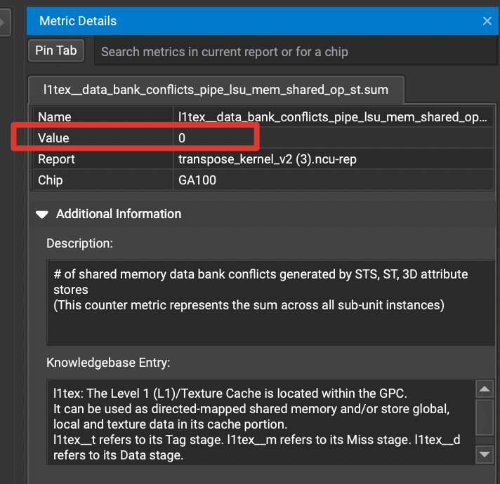

# ncu benchmark 结果
- 机器 A100 80G 500W
- M: 256, N: 256

| 实现      | 线程块形状 | 运行时间 | 计算利用率 | 带宽利用率 | 相对效率 |
| ----------- | ----------- | ----------- | ----------- | ----------- | ----------- |
| 内存拷贝      | （32, 32） | 1.60 ms | 17.13%      | 65.34%     | 100%  |
| v1(暴力)   | (32, 32)        | 2.65 ms| 10.91% | 84.54% | 60.4% |
| v2(shared memory) | (32, 32)        | 3.37 ms | 14.90%      | 67.31 | 47.5%  |
| v3(padding 优化 bank conflict) | (32, 32)        | 1.82 ms | 27.61%      | 57.42% | 87.9%  |


ncu 命令：
```
ncu --section regex:'^(?!Nvlink)'  --kernel-name transpose_v2 -o transpose_kernel_v2 -f pytest ./tests/test_kernel.py
```
> NOTE: 
> 未解决 bank conflict 的 kernel v2 比 v1 慢，是数组数目太少的原因，待进行更详细的 profile。

# kernel v1
最暴力的写法，开 M * N 个线程，让线程 (x,y) 负责对 A^T 找到其对应的值 A

# kernel v2
采用 shared memory 优化，一个线程块计算一个 (32, 32) 的数据，这个 （32, 32）大小的数据都会存放到 shared memory 中，最后计算出结果。

# kernel v3
kernel v2 的问题是存在 bank conflict，一个简单的方法验证 kernel 是否存在 bank conflict 的方法是在 ncu 界面的左上角点击 Profile 选项 -> 点击 Metric Details 选项，在弹出的界面的搜索框里输入 `l1tex__data_bank_conflicts_pipe_lsu_mem_shared_op_st.sum` 回车，可以看到下面的 value 为 0 表示无 bank conflict，不为 0 表示有 bank conflict。



我们解决 bank conflict 的方法也很简单，就是 padding，将 shared memory 的形状改为 [32, 33] 即可。

# TODO(Double buffing)

